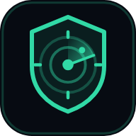
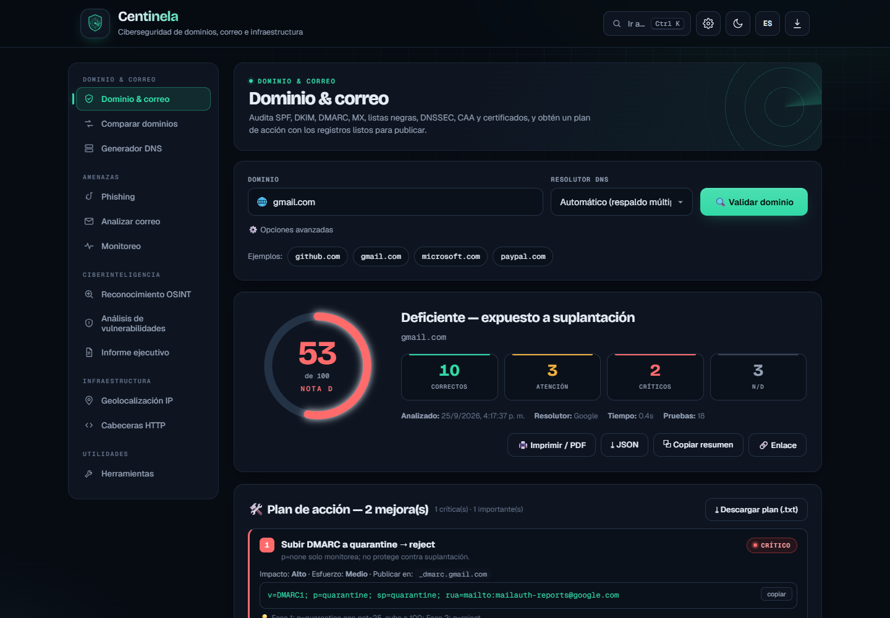
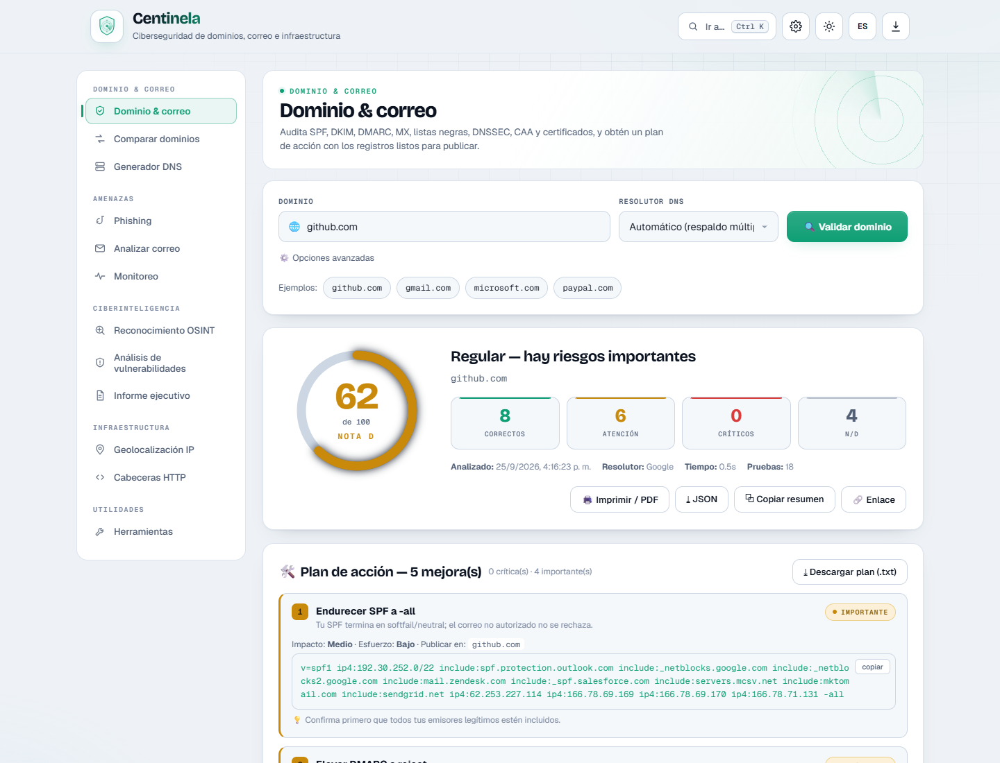
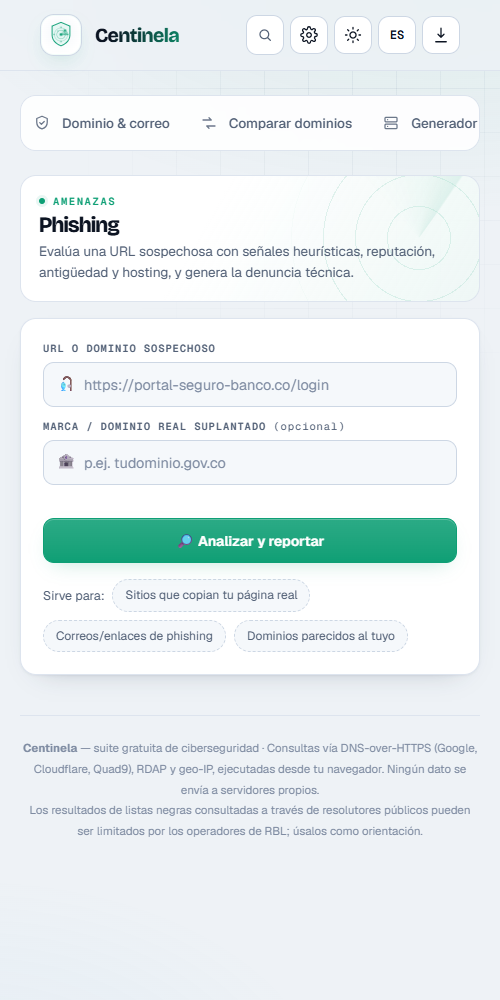

<p align="center">
  
</p>

<h1 align="center">Centinela</h1>

<p align="center">
  <b>Suite gratuita de ciberseguridad para dominios, correo e infraestructura.</b><br>
  Funciona 100 % en el navegador: sin instalar nada y sin enviar tus datos a servidores propios.
</p>

<p align="center">
  <a href="https://claxus06.github.io/centinela/"><b>▶ Abrir Centinela</b></a> ·
  <a href="#módulos">Módulos</a> ·
  <a href="#privacidad">Privacidad</a> ·
  <a href="#publicar-tu-propia-copia">Publicar</a> ·
  <a href="SECURITY.md">Reportar una vulnerabilidad</a>
</p>



## Qué hace

Escribes un dominio y Centinela revisa su configuración de correo y DNS, busca dominios que lo imitan, evalúa su exposición a vulnerabilidades conocidas y te entrega un **plan de acción con los registros listos para copiar y publicar**.

Está pensada para equipos de TI y seguridad de entidades públicas y empresas, en especial en Colombia (incluye los canales oficiales de denuncia y el marco legal de la Ley 1273 de 2009).

## Módulos

| Grupo | Módulo | Qué obtienes |
|---|---|---|
| Dominio y correo | **Dominio & correo** | 18 controles: SPF (con árbol de consultas), DKIM, DMARC, MX, MTA-STS, TLS-RPT, BIMI, listas negras, DNSSEC, DANE, CAA, certificados (CT), PTR, WHOIS/RDAP y geolocalización. Puntaje de 0 a 100 y plan de acción. |
| | **Comparar dominios** | Dos dominios frente a frente, control por control. |
| | **Generador DNS** | Registros SPF, DMARC, MTA-STS, TLS-RPT y CAA según tus proveedores de correo. |
| Amenazas | **Phishing** | Riesgo de una URL sospechosa (homóglifos, TLD, antigüedad, reputación, hosting) y denuncia técnica lista para enviar. |
| | **Analizar correo** | Revisa los encabezados de un correo: SPF, DKIM, DMARC, Reply-To engañoso e IP de origen. |
| | **Monitoreo** | Avisa si cambian SPF, DMARC, MX o nameservers, o si el dominio entra en una lista negra. |
| Ciberinteligencia | **Reconocimiento OSINT** | Dominios que imitan tu marca (typosquatting + Certificate Transparency) con expediente de cada uno y más de 40 pivotes OSINT. Exporta IOCs en TXT, CSV y JSON. |
| | **Análisis de vulnerabilidades** | Puertos expuestos, CVE con CVSS, catálogo **CISA KEV**, postura de correo y *subdomain takeover*. Calificación de A a F. |
| | **Informe ejecutivo** | Une los módulos anteriores en un informe listo para guardar en PDF. |
| Infraestructura | **Geolocalización IP** | Mapa, ASN, proveedor, DNS inverso y reputación de una IP o dominio. |
| | **Cabeceras HTTP** | HSTS, CSP, anti-clickjacking y demás cabeceras de seguridad (requiere el backend opcional). |
| Utilidades | **Herramientas** | Contraseñas filtradas (k-anonimato), generador de claves, hashes, Base64/URL y decodificador JWT. |

<table>
  <tr>
    <td width="68%"></td>
    <td width="32%"></td>
  </tr>
  <tr>
    <td align="center"><sub>Tema claro</sub></td>
    <td align="center"><sub>Vista móvil</sub></td>
  </tr>
</table>

## Atajos

| Tecla | Acción |
|---|---|
| <kbd>Ctrl</kbd> + <kbd>K</kbd> (<kbd>⌘</kbd> + <kbd>K</kbd> en Mac) | Buscar e ir a cualquier módulo o acción |
| <kbd>/</kbd> | Poner el cursor en el campo principal del módulo actual |
| <kbd>Esc</kbd> | Cerrar la paleta o los ajustes |

Cada módulo tiene su propio enlace, por ejemplo [`#/phish`](https://claxus06.github.io/centinela/#/phish) o [`#/vuln`](https://claxus06.github.io/centinela/#/vuln). También puedes enlazar un análisis directo: [`?d=ejemplo.com`](https://claxus06.github.io/centinela/?d=github.com).

## Privacidad

- Las consultas salen **directamente de tu navegador** a servicios públicos: DNS-over-HTTPS (Google, Cloudflare, Quad9), RDAP, crt.sh, Shodan InternetDB, CIRCL, CISA y proveedores de geo-IP.
- Ajustes, historial y dominios monitoreados se guardan solo en tu navegador (`localStorage`).
- La verificación de contraseñas usa k-anonimato: solo se envían los 5 primeros caracteres del hash SHA-1.
- Los análisis son **pasivos**: no hay escaneo activo, explotación ni pruebas intrusivas. Úsala solo sobre infraestructura propia o autorizada.

## Instalar como app

Abre la URL en Chrome, Edge o Safari y usa **Instalar** (o el botón ⬇ de la cabecera). En el móvil: menú → **Agregar a pantalla de inicio**. Funciona sin conexión para las herramientas locales.

## Publicar tu propia copia

Es un sitio estático: no necesita compilación.

**GitHub Pages** (el de este repo)
1. Sube los archivos a la raíz de la rama `main`.
2. **Settings → Pages → Deploy from a branch → `main` / `(root)`**.
3. En 1–2 minutos queda en `https://TU-USUARIO.github.io/NOMBRE-DEL-REPO/`.

> Si cambias el nombre del repositorio, actualiza las rutas `/centinela/` de `404.html` y las URL absolutas de `index.html` (Open Graph y `canonical`).

**Netlify o Cloudflare Pages.** Arrastra la carpeta a <https://app.netlify.com/drop> o súbela en Cloudflare Pages → *Direct Upload*. Estos servicios sí aplican las cabeceras de seguridad de `_headers` y `netlify.toml` (GitHub Pages las ignora).

### Backend opcional

El módulo de cabeceras HTTP y la verificación con VirusTotal necesitan un Cloudflare Worker, porque el navegador no puede leer esos datos por CORS. Cuando lo tengas desplegado, pega su URL en **⚙ Ajustes → URL del backend**.

## Estructura

```
index.html            La aplicación completa (HTML, CSS y JS)
404.html              Página para rutas inexistentes
sw.js                 Service worker: modo sin conexión
manifest.webmanifest  Instalación como app (PWA)
icon.svg              Ícono vectorial
assets/               Íconos PNG, imagen para compartir y capturas
_headers, netlify.toml  Cabeceras de seguridad (solo Netlify / Cloudflare Pages)
sitemap.xml, .nojekyll  Configuración para GitHub Pages
```

## Seguridad

¿Encontraste un fallo? Lee [SECURITY.md](SECURITY.md) y repórtalo de forma privada.

## Licencia

[MIT](LICENSE) © 2026 Claxus06
